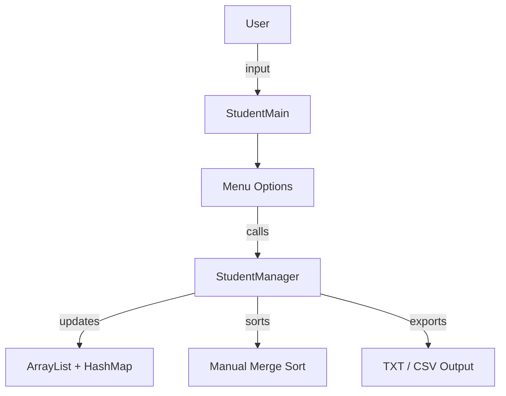

#  Student Management System using Java and DSA

**Student Name:** Nguyen Trung Tri Tinh  
**Student ID:** BC00466  
**Class:** SE07201  
**Course:** Data Structures and Algorithms  

---

##  What does this project do?

This Java application allows users to:

-  Add new students  
-  Edit or delete student information  
-  Rank students based on their average score (Excellent → Poor)  
-  Search for students by ID instantly  
-  Export student records to `.txt` or `.csv` files  

---

##  Code Explanation (3 Main Files)

### 1. `Student.java` – Student Object
This class defines the structure of each student, including:
- Attributes: `id`, `name`, and `score`
- A method to calculate the student's **academic rank** (e.g., Excellent, Very Good, Good, Average, Poor)
- Overrides the `toString()` method to print formatted student info (used when displaying data or exporting files)

### 2. `StudentManager.java` – Core Logic
This is the **central class** for managing all student operations:
- Uses `ArrayList<Student>` to store a flexible list of students
- Uses `HashMap<String, Student>` for **fast lookup by ID**
- Implements **manual Merge Sort** to sort students by score in descending order
- Exports student lists and activity logs to `.txt` and `.csv` formats

### 3. `StudentMain.java` – User Interface
This is the main menu interface:
- Shows a menu to let users choose actions like Add, Edit, Delete, Search, View Ranking, Export
- Validates input (e.g., score range must be 0–10, name must not contain numbers/symbols)
- Uses `try-catch` blocks to handle exceptions (e.g., invalid input)
- Connects all actions with methods from `StudentManager`

---

##  System Flow Diagram



---

##  Why use Merge Sort?

- Time Complexity: **O(n log n)**
- Stable and efficient: maintains order of equal values
- Works better than Bubble Sort or Selection Sort on larger data
- Manually implemented in code (not using built-in `Collections.sort()`)

---

##  Data Structures Applied

| Structure   | Use Case                                      |
|-------------|-----------------------------------------------|
| `ArrayList` | Store and manage a dynamic student list        |
| `HashMap`   | Quickly search students by ID (O(1) access)    |
| `MergeSort` | Efficiently sort students by average score     |

---

##  How to Run This Project

```bash
javac Student.java StudentManager.java StudentMain.java
java StudentMain
```

Or compile all files at once:

```bash
javac *.java
java StudentMain
```

---

##  Author

**Nguyen Trung Tri Tinh**  
**Student ID:** BC00466  
**Class:** SE07201  
**Course:** Data Structures and Algorithms
